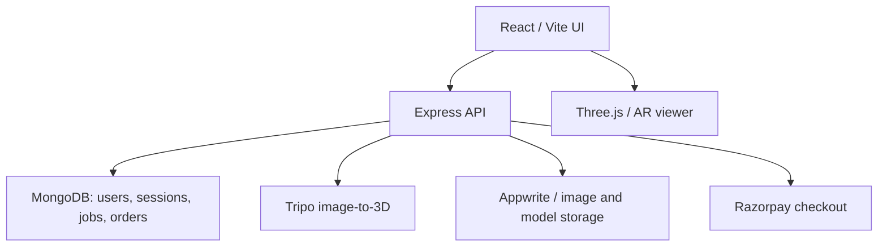

# 🛋️ ARTifact

**Turn a furniture photo into a 3D model, preview it in AR, and manage your designs in one place.**

ARTifact is a React and Node.js application for exploring furniture in 3D. Users can browse a curated GLB catalog or upload an image for asynchronous image-to-3D generation with Tripo. The app tracks generation jobs and credits, keeps model history, supports mobile AR previews and AR captures, and includes authentication, payment, and catalog administration workflows.

> **Snapshot scope:** This README describes the code in the latest project archive shared on **24 September 2026**. The archive does not contain a root or server `package.json`, and changes made after that archive (including the latest deployed admin UI) cannot be verified from it. Check the current repository before claiming those updates are shipped.

---

## 📋 Table of Contents

- [What is Implemented](#-what-is-implemented)
- [Recent Additions](#-recent-additions-from-a-developers-perspective)
- [Architecture](#-architecture)
- [Repository Map](#-repository-map)
- [Core Flows](#-core-flows)
- [API Map](#-api-map)
- [Run Locally](#-run-locally)
- [Deployment and Checks](#-deployment-and-checks)
- [Current Boundaries and Roadmap](#-current-boundaries-and-roadmap)
- [Contributors](#-contributors)

---

## ✅ What is Implemented

| Area | Current Capability | Engineering Detail |
|---|---|---|
| **Accounts** | Registration, email OTP verification/resend, login, Google sign-in, password reset/change, session refresh, logout and logout from all devices | Validated request schemas, rate limits, access tokens and refresh-cookie flow |
| **Profile** | Profile edits and profile image upload | Authenticated profile routes and external image storage |
| **Image to 3D** | Upload JPEG, PNG or WebP, create a Tripo generation task, poll progress, view resulting GLB | 10 MB input cap, authenticated endpoints, provider failure handling |
| **Generation Library** | Dashboard, generation status and paginated history | Persistent `GenerationJob` documents; job reconciliation script |
| **Credits** | Reserve a credit when submitting generation; release/refund when appropriate | Entitlements and credit ledger coordinate generation and payment state |
| **Model Access** | Preview generated models with a Three.js viewer and AR viewer | Signed model access URLs and server-side model storage/streaming |
| **Catalog** | Browse ready-made furniture models with thumbnails | MongoDB catalog metadata and Appwrite Storage files; sample GLB bundled for development |
| **AR Captures** | Save and list an AR capture | Authenticated capture endpoints and `ARCapture` model |
| **Payments** | List plans, create Razorpay orders, verify payments | Validation, signature verification, idempotency key, payment state and financial/audit ledger models |
| **Administration** | Admin-only catalog upload and unlock check | Role gate plus separate short-lived admin token; GLB and thumbnail magic-byte validation |

---

## 🚀 Recent Additions (from a developer's perspective)

- **Durable generation pipeline** — Generation requests are represented as jobs instead of existing only in React state. A reconciliation script can revisit jobs after a restart, and model storage decouples the returned GLB from the provider's temporary URL.
- **Credit-aware generation** — Credit reservation is tied to the job submission path, with recovery/refund helpers for failed work. The credit ledger provides a record of changes.
- **Idempotent operations** — Generation and order creation require an `Idempotency-Key` header, so repeated requests can be handled without unintentionally creating duplicate work or purchases.
- **Payment records and verification** — Razorpay checkout is connected to server-side order creation and signature verification, supported by payment orders, entitlements, webhook event and audit/financial models. Inspect the deployment before enabling live payments.
- **More complete auth lifecycle** — Email verification, Google login, password recovery, access-token refresh, session tracking and logout-all routes now sit behind dedicated validators and rate limiters.
- **Curated asset pipeline** — Admin catalog upload stores GLB and image files in Appwrite. The route requires both an admin role and a second unlock token, checks the file contents, and cleans up uploaded files if subsequent work fails.
- **AR capture and profile flows** — Authenticated capture endpoints and profile settings extend the product beyond a single generation screen.
- **API safeguards and diagnostics** — CORS allowlisting, Helmet, cookie request protection, correlation IDs, request validation and centralized error handling appear in the server.

---

## 🏗️ Architecture



**Frontend:** React 19, React Router, Vite, Three.js, React Three Fiber and Drei. The app includes landing, auth, dashboard, create model, history, catalog, payment plans and settings pages. An auth context and shared API service manage requests and session state.

**Backend:** CommonJS Node.js and Express API with Mongoose/MongoDB. Routes are split between auth, profile, payments, catalog, AR captures and admin functions; generation endpoints currently live in `server/index.js`. Integrations include Tripo, Razorpay and Appwrite. Cloudinary support is also present for image storage.

---

## 🗂️ Repository Map

```
client/
  public/              Sample chair.glb and static assets
  src/components/       AR viewer, model viewer, progress, auth, payment UI
  src/context/           Auth state
  src/pages/              Landing, dashboard, generation, history, catalog, settings
  src/routes/             Public and protected routes
  src/services/           API, auth and checkout calls

server/
  config/                 Database and provider configuration
  controllers/            Authentication and payment logic
  middleware/             Authentication, security, rate limits, validation
  models/                 Users, sessions, jobs, captures, catalog, payment data
  routes/                 Feature endpoints
  scripts/                Generation reconciliation and catalog seed
  services/               Storage, OTP, tokens, credits, model access, payment state
  validators/             Auth and payment request schemas
  index.js                Express setup and generation endpoints
```

---

## 🔄 Core Flows

### Create a 3D Model

1. Authenticate and select an image in **Create Model**.
2. Send it as multipart form data to `POST /api/generate-3d` with an `Idempotency-Key`.
3. The server validates the image, reserves a credit, uploads to Tripo and stores the task against a generation job.
4. The client polls `GET /api/task/:taskId`. When complete, the model is stored and made available through the model access flow.
5. View it in the model/AR viewer and find it later in `GET /api/v1/generations`.

> Provider processing is asynchronous. Generation time and output quality depend on Tripo; the app must handle pending, failed and completed jobs.

### Buy Credits

1. Read available plans from `GET /api/v1/payments/plans`.
2. Create an order with `POST /api/v1/payments/orders` and an `Idempotency-Key`.
3. Complete Razorpay checkout in the client.
4. Submit the payment details to `POST /api/v1/payments/verify`; the backend verifies the signature and grants the corresponding entitlement.

### Publish a Catalog Model

1. Sign in using an account whose database role is `admin`.
2. Unlock the admin operation via `POST /api/v1/admin/unlock` using the separately configured admin password.
3. Send `model` (valid GLB, at most 25 MB), `thumbnail` (PNG/JPEG/WebP, at most 5 MB), `name`, `category` and optional `description` to `POST /api/v1/admin/catalog`, with the returned token in `X-Admin-Token`.
4. Assets are stored in Appwrite and metadata is added to the catalog. The unlock token expires after 15 minutes.

> Changing a user's role in MongoDB is a separate administrative operation. Do not expose database credentials or the admin password in the frontend.

---

## 🔌 API Map

| Prefix | Key Endpoints |
|---|---|
| `/api/v1/auth` | `POST /register`, `/verify-email`, `/resend-email-otp`, `/login`, `/google`, `/refresh`, `/logout`, `/logout-all`, `/forgot-password`, `/reset-password`, `/change-password`; `GET /me` |
| `/api/v1/profile` | `PATCH /`; `POST /photo` |
| `/api` | `GET /health`, `/task/:taskId`, `/model/:taskId`; `POST /generate-3d` |
| `/api/v1/generations` | `GET /` — paginated history |
| `/api/v1/catalog` | `GET /` |
| `/api/v1/ar-captures` | `POST /`, `GET /` |
| `/api/v1/payments` | `GET /plans`; `POST /orders`, `/verify` |
| `/api/v1/admin` | `POST /unlock`, `/catalog`; `GET /check` |

> Inspect the route implementations for exact body schemas and response shapes before integrating another client.

---

## 💻 Run Locally

1. Install the required Node.js version for your repository and install dependencies in the project root/`server` and `client` directories.
2. Create a server `.env` with the MongoDB URI, token secrets and provider credentials; create `client/.env.local` for public frontend configuration.
3. Start the backend from the project root with its configured `npm start` script (the current archive does not include that root manifest). Start the frontend with:
   ```bash
   cd client && npm install && npm run dev
   ```
4. Visit the Vite URL, normally `http://localhost:5173`; the API defaults to port `5000`.

**Example variable names used by the code:**

```bash
# server/.env or root .env according to the backend start directory
PORT=5000
NODE_ENV=development
CLIENT_URLS=http://localhost:5173
MONGODB_URI=<mongodb-connection-string>
JWT_ACCESS_SECRET=<long-random-secret>
JWT_REFRESH_SECRET=<long-random-secret>
TRIPO_API_KEY=<tripo-api-key>
APPWRITE_ENDPOINT=<appwrite-endpoint>
APPWRITE_PROJECT_ID=<project-id>
APPWRITE_BUCKET_ID=<bucket-id>
APPWRITE_API_KEY=<server-only-api-key>
RAZORPAY_KEY_ID=<key-id>
RAZORPAY_KEY_SECRET=<server-only-secret>
ADMIN_ACCESS_HASH=<argon2-password-hash>
```

```bash
# client/.env.local
VITE_API_URL=http://localhost:5000
VITE_GOOGLE_CLIENT_ID=<google-oauth-client-id>
```

> Additional provider and email settings are referenced in `server/services/` and `server/config/`; configure those used by your deployment. **Never commit `.env` files, API keys, JWT secrets or an admin password.** `CLIENT_URLS` is a comma-separated allowlist of exact frontend origins; include the production frontend origin when deploying. Razorpay and Appwrite configuration is loaded at startup, so missing credentials may prevent the API from starting.

---

## ✅ Deployment and Checks

- Build the client with `cd client && npm run build`; run `npm run lint` for its ESLint checks.
- Confirm `/api/health` and database connectivity after starting the server.
- Exercise sign-up, OTP, Google sign-in, token refresh, generation and model retrieval against the intended origin.
- Use Razorpay test credentials and test checkout before considering live payments.
- Confirm the Appwrite bucket and server key can create/read catalog assets, and ensure CORS permits the deployed frontend origin.
- Run `server/scripts/reconcileGenerations.js` when recovering submitted generation jobs after an interrupted process.

---

## 🧭 Current Boundaries and Roadmap

The code snapshot includes an AR viewer and capture support; automatic room scanning, exact room measurements, miniature room editing, wall recoloring, furniture recommendations, and mobile app packaging are **future product ideas**, not verified implementations in this snapshot.

- The bundled archive is missing the root/server `package.json` manifest and does not establish a passing end-to-end deployment.
- An admin upload route exists, but this snapshot does not include a corresponding admin upload page in the frontend.
- The payment data model contains webhook event support; confirm a deployed webhook route before documenting automatic webhook fulfillment.

---

## 👥 Contributors

ARTifact is a student project developed collaboratively.

| Contributor | GitHub | Contribution |
|---|---|---|
| **Parth Nikam** | [@Parth170606](https://github.com/Parth170606) | ~40% of frontend development |
| **Sahil Pote** | [@Sahilpote11](https://github.com/Sahilpote11) | Image-to-3D model generation pipeline |

> Add repository URL, screenshots and the chosen license after confirming them with the team.
